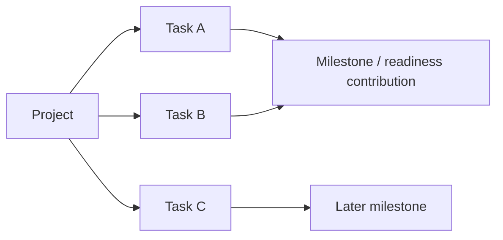
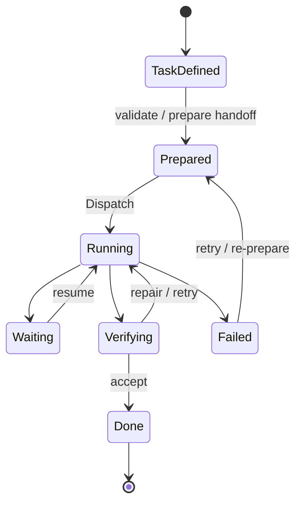
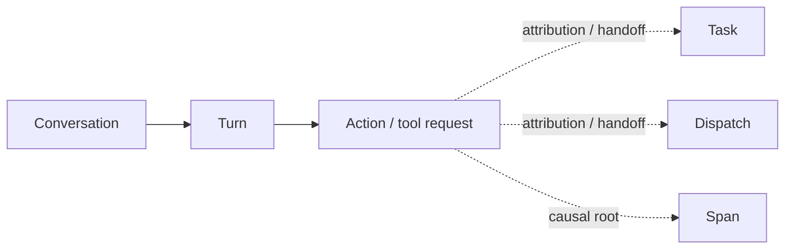
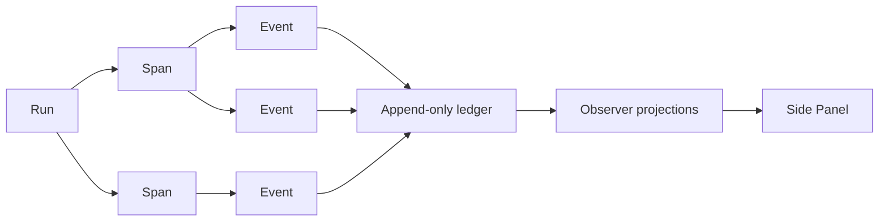
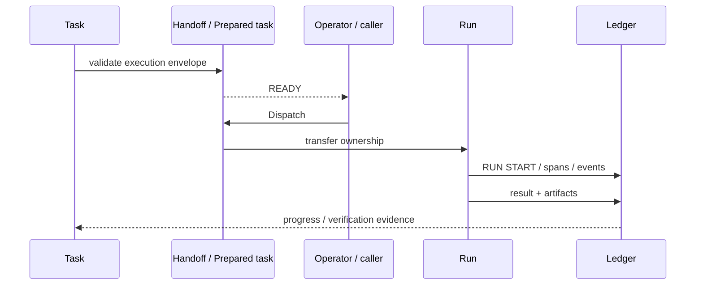

# Execution Delivery Harness lifecycle model

Status: canonical conceptual model
Date: 2026-10-06
Audience: operator, UI designer, Harness implementer

## Why this model exists

The Harness observes and controls several different kinds of lifecycle at once:

- human communication in ChatGPT;
- delivery work inside a Project;
- orchestration of a Task;
- transfer of work into an executor;
- one concrete execution attempt;
- process/tool spans;
- raw evidence.

These are related, but they are **not one hierarchy**. The Side Panel must not make a Chat look like a Project, a Task look like a Run, or a prepared handoff look like an already-running execution.

The shortest useful rule is:

> **Conversation is context. Project is delivery scope. Task is intended work. Dispatch is a handoff. Run is one execution attempt. Span is one operation. Event is evidence.**

## The four coordinate systems

### 1. Delivery hierarchy — the macro work graph



A **Project** is a durable delivery scope owned by the Harness. It is not a ChatGPT conversation.

A **Task** is a unit of intended work inside a Project. It has a goal, lifecycle state, progress, budget and checkpoints.

Project readiness is a projection over the Project task graph. It answers questions such as:

- how much of this Project is complete;
- what remains;
- what blocks the next milestone;
- what the aggregate remaining effort looks like.

It does **not** answer “how complete is this chat?”

### 2. Task-to-execution lifecycle — the micro work cycle



This is the lifecycle that the current **Current task** and **Run** panels are trying to expose.

A **Task** can exist before any Run exists.

A **Prepared task** is not a Run. It is a validated execution envelope that is ready to cross the ownership boundary into an executor.

**Dispatch** is the explicit transition that hands the prepared work to Harness-owned execution.

A **Run** is one durable execution attempt for the Task.

One Task can have:

- zero Runs, while it is only planned/prepared;
- one successful Run;
- several Runs because of retry, repair resume;
- eventually parallel Runs when the ownership model supports them.

### 3. Communication and attribution — where the request came from



A **Conversation** and **Turn** describe communication provenance.

They do not own the Project hierarchy.

A single conversation may discuss or operate on multiple Projects:

```text
Chat 6ac414f9…
  ├─ Project: Execution Delivery Harness
  ├─ Project: RF-Rover
  └─ one-off diagnostic work with no durable Project
```

Conversely, one Project may continue across several conversations, devices and executors:

```text
Project: Execution Delivery Harness
  ├─ Chat A — architecture
  ├─ Chat B — live acceptance
  ├─ phone session — incident / observation
  └─ local executor — implementation run
```

Therefore chat identity and project identity are orthogonal coordinates. The ledger may carry both.

### 4. Execution evidence — what actually happened



A **Span** is one causally scoped operation performed by an actor, tool or process.

An **Event** is raw evidence: start, progress, output, error, completion, observation.

The ledger is the historical source of truth. The Side Panel is a projection over that evidence.

## Macro cycle versus micro cycle

```text
MACRO DELIVERY CYCLE
Project
 ├─ Task A ────────────┐
 ├─ Task B ───────┐    │
 └─ Task C ───┐    │    │
              │    │    │
              ▼    ▼    ▼
MICRO EXECUTION CYCLE FOR ONE TASK
Task
  → prepare
  → Prepared task
  → Dispatch
  → Run
      → spans
      → events
      → checkpoint / waiting / verification
  → result
  → task progress/readiness update
  → Project readiness recomputed
```

The macro cycle answers **“where are we in the delivery effort?”**

The micro cycle answers **“what is happening to this particular piece of work?”**

## Current task panel

The **Current task** panel represents the orchestration state of one Task, not the latest process and not the whole Project.

Its two groups answer different questions.

### Goal & state

| Field | Meaning |
| --- | --- |
| Task | Stable Harness task identifier |
| Status | High-level lifecycle status such as WAITING, RUNNING, DONE or ERROR |
| Phase | Finer-grained orchestration phase such as VERIFYING |
| Goal | Outcome this task is expected to produce |
| Waiting | Why orchestration cannot advance |
| Checkpoint | Latest durable resume/interruption boundary |

### Progress & budget

| Field | Meaning |
| --- | --- |
| Completed | Lifecycle steps already accepted |
| Current | Step currently considered in progress |
| Pending | Known remaining steps |
| Budget | Execution limits allocated to the task |
| Budget used | Observed consumption of that allocation |

`safe to interrupt` is an informational orchestration-safety statement. It does not itself stop anything. It tells an operator whether an explicit stop/pause action can be expected to preserve accepted progress.

## Execution cycle / current Run panel

The current UI calls this panel **Run**, but it presently spans more than the strict Run entity:

```text
           PRE-RUN                    RUN                     POST-RUN
              │                        │                          │
Task ──> Prepared task ──Dispatch──> Run / ownership ──> verification/result
              │                        │                          │
              └──────────── current Side Panel “Run” block ──────┘
```

This is why a future rename to **Execution** or **Execution cycle** may be clearer. Until that UI decision is accepted, the documentation distinguishes the strict Run entity from the wider panel.

### Execution & ownership

This group describes the actual execution instance:

| Field | Meaning |
| --- | --- |
| Controller | Durable controller identity that owns execution |
| Status | High-level Run state |
| Phase | Current/terminal execution phase |
| PID | Local OS process when a live process exists |
| Ownership | Which subsystem is responsible for progressing the Run |
| Mode | Detached, interactive or another execution ownership mode |
| Safe to interrupt | Declared interruption boundary for this Run |
| Run dir | Durable filesystem state/evidence directory |

The question answered is:

> **Who owns this execution, how is it running, and can it be safely interrupted?**

### Handoff & result

This group describes the boundary into execution and the latest outcome:

| Field | Meaning |
| --- | --- |
| Prepared task | A validated execution envelope waiting to be started |
| Dispatch | Explicitly transfer that prepared envelope into Harness-owned execution |
| Result | Final/last result reported by the execution |
| Task | Task associated with the handoff |
| Correlation | Causal identity connecting the handoff/run to evidence |
| Runtime | Elapsed execution time |
| Executor | Runtime that performed the work |
| Model | Model/runtime used by the executor |
| Artifacts | Durable outputs produced or changed |
| Outcome | Harness interpretation of why the execution ended in that result |

The question answered is:

> **How did work cross into execution, and what came back out?**

### Prepared task and Dispatch



The green **Dispatch** button therefore means:

> “The Harness has a prepared execution envelope. Start a new Harness-owned Run from it.”

It is not “continue the current Run” and it is not “accept the result”.

A prepared handoff should disappear once it is no longer ready.

## Project readiness panel

Project readiness is a **macro projection over one selected Project**.

It should eventually be rendered as:

```text
Active project
Execution Delivery Harness

Project readiness · 59% · 4/36 done
  Overall
  Completed
  Critical path
  Next milestone
  Remaining ETA
  Observed activity
```

The current UI is incomplete because it shows readiness without showing the Project identity prominently enough.

### Important cardinalities

```text
Conversation  * ──────── * Project
Project       1 ──────── * Tasks
Task          1 ──────── * Runs
Run           1 ──────── * Spans
Span          1 ──────── * Events
```

The many-to-many relation between **Project** and **Conversation** is intentional.

## Side Panel interpretation

The Side Panel should be read vertically as:

```text
Actors / operator status
        │
        ▼
Current task
“What intended work is the Harness orchestrating?”
        │
        ▼
Execution cycle / Run
“How is this task crossing into and through execution?”
        │
        ▼
Active project readiness
“What did this task/run change in the broader delivery effort?”
        │
        ▼
Spans / transports / attribution
“How exactly was the work executed and correlated?”
        │
        ▼
Unified timeline
“What raw evidence was observed?”
```

This vertical order is a projection for an operator. It is not a claim that every entity is a strict child of the previous UI card.

## Design consequences

1. Rename or qualify **Project readiness** with the selected Project identity before treating it as a finished UI component.
2. Consider renaming the current **Run** card to **Execution** or **Execution cycle**, because it contains pre-run handoff state and post-run outcome in addition to the strict Run entity.
3. Do not use current ChatGPT conversation as an implicit Project key.
4. Task identity, Project identity, conversation identity and Run identity must remain separate ledger dimensions.
5. A future project selector must not be conflated with the Unified timeline chat selector.
6. Help and field tooltips should link back to this lifecycle vocabulary rather than inventing local explanations per card.
