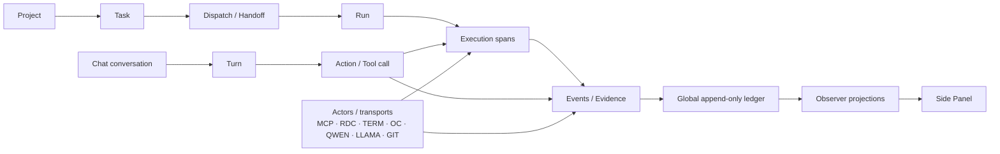

# Side Panel information architecture and semantic map

Status: design baseline  
Date: 2026-10-06  
Scope: Chrome Side Panel first; browser-neutral semantics for Observer projections

## Why this document exists

The current Side Panel exposes useful evidence, but it mirrors too many internal Harness concepts directly into top-level UI blocks. The result is a long diagnostic page where runtime state, project state, task state, run state, transport state, causal evidence, raw logs and help compete for attention.

The goal is not to hide information. The goal is **progressive disclosure**:

- Level 0 — glanceable operational truth;
- Level 1 — work and decision context;
- Level 2 — diagnostics and forensic evidence.

A user should be able to answer these questions in order:

1. Is the Harness healthy and what is active now?
2. What is it working on?
3. Does this work belong to the expected chat/task/run?
4. Is anything blocked or degraded?
5. Where is the evidence if I need to inspect it?

## Domain map



### Semantic meanings

| Entity | Question it answers | User-facing importance |
| --- | --- | --- |
| Project | How complete is the broader delivery effort? | Secondary |
| Task | What goal is currently being worked on? | Primary |
| Dispatch / Handoff | How did work cross into Harness ownership? | Diagnostic unless failed |
| Run | Which durable execution instance owns the task? | Primary while active; secondary after completion |
| Span | Which actor/process is doing work right now? | Secondary; primary on failure |
| Event | What raw evidence was observed? | Forensic |
| Chat | Which conversation is the human/work root? | Primary attribution context |
| Turn | Which interaction owns this work? | Diagnostic/causal |
| Actor | Which component/tool is active or unhealthy? | Primary glanceable state |
| Ledger | What actually happened? | Forensic source of truth |

## Screen map

The Side Panel should have five semantic zones, not a sequence of unrelated cards.

```text
┌─────────────────────────────────────────────────────┐
│ 1. ACTOR STRIP                                      │
│ MCP · RDC · TERM · OC · QWEN · LLAMA · GIT         │
├─────────────────────────────────────────────────────┤
│ 2. OPERATOR STATUS                                  │
│ WAITING / BUSY / STALLED / IDLE                     │
│ attribution health · actionable warnings · ⚙ · ?    │
├─────────────────────────────────────────────────────┤
│ 3. WORK                                             │
│ Current task                         [collapsed/open] │
│ Active/last run                      [collapsed/open] │
│ Project readiness                    [collapsed]      │
├─────────────────────────────────────────────────────┤
│ 4. EXECUTION / DIAGNOSTICS                          │
│ Execution spans                     [collapsed/open] │
│ Transports & background              [collapsed]      │
│ Attribution diagnostics              [conditional]    │
├─────────────────────────────────────────────────────┤
│ 5. EVIDENCE                                         │
│ Unified timeline filter + health                    │
│ raw timeline                                        │
└─────────────────────────────────────────────────────┘
```

The first two zones must fit without scrolling.

## 1. Actor strip — always first

Current form:

`MCP · RDC 5:39 · TERM 1 open · OC · QWEN · LLAMA idle · GIT Δ0`

This is the best top-level summary of the system and should be the first content row beneath the Side Panel title.

### Interaction

Each actor chip has three levels of disclosure:

- **visible label** — compact state;
- **hover tooltip** — full actor name and one-line meaning;
- **click** — actor/transport detail drawer with paths, runtime/configuration and recent activity.

Examples:

| Chip | Hover | Click details |
| --- | --- | --- |
| MCP | Model Context Protocol activity observed through configured MCP sources | connected clients, version, policy, recent calls |
| RDC | Remote Desktop Commander transport and process-control activity | endpoint/device, last command, permissions |
| TERM | Harness-observed terminal/process lifecycle | open processes, PID/start identity |
| OC | OpenCode worker | executable/version/config |
| QWEN | primary local model actor | model alias/path/runtime |
| LLAMA | llama.cpp inference runtime | server address, slot, model |
| GIT | repository working-tree state | repo path, branch, HEAD, dirty summary |

The chip is not a log line and should never expand the whole screen by itself.

## 2. Operator status — always visible

This zone answers: **“Do I need to do anything right now?”**

Keep:

- state: `BUSY / WAITING / STALLED / IDLE / DEGRADED`;
- concise active-chain summary when useful;
- Settings and Help controls;
- actionable warnings.

Move out of the permanent header:

- `trace-ui12`;
- gateway commit hashes when healthy;
- extension semver when healthy.

Those belong in diagnostics/settings. Version information becomes top-level only when there is drift:

`Update available · 0.1.9 → 0.1.10`

or:

`Gateway restart required · a484c2d → …`

### Remove the permanent “Gap” button

`Gap: ChatGPT turn → Harness gateway` is implementation language, not an operator action.

Replace it with a **conditional attribution-health warning** only when the current/recent signal is degraded:

`Attribution degraded · 71/73 recent events unscoped`

Interaction:

- hover: one-line explanation;
- click: attribution diagnostics;
- CTA appears only if there is an actual action the user can take.

When attribution is healthy:

`Attribution healthy · 100% · 6/6 recent`

This may be subtle and does not need a large card.

## 3. Work

### Current task — primary work object

Header example:

`Current task · VERIFYING · safe to interrupt`

Default:

- open while actively running/waiting;
- collapsed after terminal completion.

Expanded content is grouped, not dumped:

**Goal**
- user-visible task goal

**Progress**
- Completed
- Current
- Pending

**Control**
- safe to interrupt
- waiting reason
- durable checkpoint

**Budget**
- deadline
- max steps
- tokens
- repairs
- used

The current standalone block:

```text
Completed: ...
Current: ...
Pending: ...
Budget: {...}
Budget used: {}
```

must disappear as an unlabelled top-level chunk. It belongs inside `Current task → Progress / Budget`.

### Run — execution instance, not another competing task

The current UI has overlapping concepts:

- Last prepared dispatch
- Harness-owned run
- Current run in Help

These should become one **Run** concept.

Header while active:

`Run · RUNNING · detached · 57s`

Header after completion:

`Last run · PASS · 57s`

Expanded:

- controller/run id
- ownership/mode
- executor/model
- start/end/runtime
- handoff type (`prepared dispatch`, direct, resumed, etc.)
- result/outcome
- artifacts

`Prepared dispatch` is an implementation/handoff type inside Run details, not a permanent top-level block.

### Project readiness — secondary

Header:

`Project readiness · 59% · 4/35 done`

Default: **collapsed**.

Expanded:

- Overall
- Completed
- Critical path
- Next milestone
- Remaining backlog ETA
- observed activity window

Each field gets:

- hover tooltip: one-line definition;
- click/help link: longer definition/formula where needed.

Project readiness must never push current task/run/timeline below the fold by default.

## 4. Execution and diagnostics

### Execution spans

Header:

`Execution spans · 0 open · 5 recent`

Default policy:

- open automatically if an active span exists;
- open automatically on an ERROR affecting current task/run;
- collapsed when only historical terminal spans remain.

A span row should have one status owner, not status duplicated at both ends.

Proposed row:

`ERROR · MCP · list_tabs · 0s`

Secondary line:

`25m ago · browser_inferred · chat …8dd1547d`

Expanded:

- span id / parent
- actor
- stage
- elapsed
- failure code/message/cause
- source chat navigation
- evidence links

Do not show endlessly ticking elapsed counters for completed spans.

### Transports & background

The current `Remote Desktop / background · 1 open` becomes a collapsed diagnostic section:

`Transports & background · RDC active · 1 process`

Its detail includes:

- Last RDC
- age
- open process PID + state
- endpoint/device/configuration
- recent transport errors

Most of this is already summarized by the actor strip, so this section is drill-down only.

### “Current external activity — unscoped”

This should **not be a permanent top-level block**.

It is an attribution condition and belongs in one of two places:

1. operator-status warning when recent and important;
2. attribution diagnostics / timeline context when inspecting evidence.

The current `Recent correlated trace` remains useful, but should sit inside an expanded `Attribution / causal trace` section rather than consuming permanent vertical space.

## 5. Unified timeline — evidence console

The timeline is the forensic source, not the executive summary.

Header:

`Unified timeline`

Control row:

`[scope selector]   Recent attribution 100% · 6/6`

Secondary raw-buffer indicator:

`buffer: 225/300 unscoped`

This distinction is critical:

- **recent attribution health** answers whether the system is working now;
- **raw buffer composition** describes historical content still present in the 300-event window.

The scope selector is a persistent DOM island and polling must not recreate it.

Default timeline height should be bounded. The page should not become 2.5 screens tall before the log starts.

## Progressive disclosure rules

### Level 0 — always visible

- actor strip;
- operator status;
- attribution health/warnings;
- current task header;
- active run header if one exists;
- Unified timeline header/filter.

### Level 1 — one click

- current task details;
- current/last run;
- project readiness;
- execution spans;
- transports/background;
- attribution trace.

### Level 2 — forensic/details

- raw paths;
- full prompts;
- budgets as JSON;
- hashes;
- correlation/span ids;
- runtime versions;
- artifact/log paths;
- configuration paths;
- full causal provenance.

No Level-2 information should occupy permanent vertical space in the default view.

## Help model

The current Help screen duplicates runtime/run information and mixes glossary, status and diagnostics.

Replace it conceptually with:

### Concepts

- Actor
- Task
- Run
- Span
- Event
- Chat/Turn
- Attribution
- Ledger

### Controls

- pause/resume
- share/access
- reload/update
- open source chat

### Diagnostics

- runtime versions
- gateway/repo identity
- paths/config
- current run inspection
- raw artifact locations

Contextual hover help should answer the common question. The Help view is for the uncommon detailed question.

## Tooltip contract

Every non-obvious label should have a one-line definition.

Examples:

- **Overall** — average completion percentage across tracked TODO tasks.
- **Completed** — tasks whose completion is 100%.
- **Critical path** — unfinished tasks that gate the next configured milestone.
- **Remaining ETA** — backlog effort sum, not calendar delivery time.
- **Safe to interrupt** — whether the owning run declares that stopping after the current checkpoint should preserve durable progress.
- **Span** — one causally scoped unit of actor/tool/process execution.
- **Unscoped** — observed evidence with no trustworthy chat/turn root; never assigned by focus or time proximity alone.
- **browser_inferred** — chat identity inferred conservatively from one active browser turn; not authoritative transport identity.

## Information that should disappear from the default screen

Unless unhealthy or explicitly expanded:

- trace-ui build id;
- healthy gateway commit hash;
- raw runtime paths;
- full task prompt;
- raw JSON budget object;
- artifact file list;
- old finished-run diagnostic details;
- historical terminal spans;
- current external activity block when nothing requires attention.

## Proposed default collapsed state

```text
MCP · RDC 8s · TERM 1 · OC · QWEN · LLAMA idle · GIT Δ0

WAITING · Attribution healthy 100% (6/6)              ⚙  ?

Current task · VERIFYING · safe to interrupt             ▸
Last run · PASS · 57s                                     ▸
Project readiness · 59% · 4/35                           ▸
Execution spans · 0 open · 5 recent                       ▸
Transports & background · RDC active · 1 process          ▸

Unified timeline
[ Current · …8dd1547d ▼ ]   recent 100% · 6/6
┌───────────────────────────────────────────────────────┐
│ raw evidence stream                                   │
└───────────────────────────────────────────────────────┘
```

This preserves all information while changing its default cost from multiple screens to roughly one operator viewport plus the evidence console.

## UI invariants

1. Polling may update data but must not own the lifecycle of user controls.
2. A top-level block must answer a distinct operator question.
3. Internal implementation nouns do not automatically deserve top-level UI.
4. Historical data is collapsed by default.
5. Failure state is scoped to the smallest failing entity.
6. Raw evidence remains available even when semantic summaries are compacted.
7. Attribution quality is always explicit.
8. Action-like controls must either perform an action or be presented as explanation, never both ambiguously.
9. Tooltips define; expanded details explain; Help teaches.
10. The first viewport is for decisions, not forensic detail.

## Proposed implementation sequence

1. Freeze semantic names and top-level zones from this document.
2. Introduce a reusable collapsible-section component/contract.
3. Move actor strip to the first content row.
4. Replace permanent Gap CTA with attribution-health status.
5. Merge prepared-dispatch / Harness-owned-run / Help-current-run into the Run concept.
6. Fold Completed/Current/Pending/Budget into Current task details.
7. Collapse Project readiness by default.
8. Collapse Execution spans unless active/error.
9. Move RDC/background into Transports & background.
10. Move external/unscoped trace into Attribution diagnostics.
11. Add tooltip glossary metadata.
12. Add recent-attribution health next to the Unified timeline scope.
13. Rework Help into Concepts / Controls / Diagnostics.
14. Run one full visual acceptance pass at narrow Side Panel width before adding new top-level blocks.
